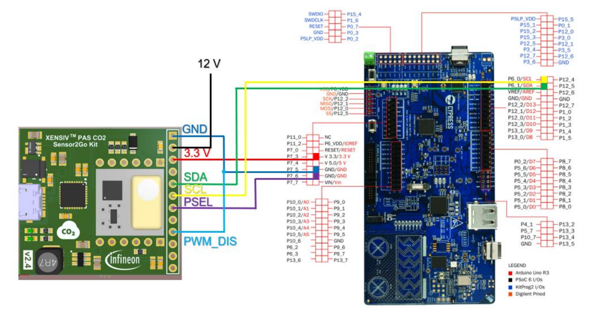
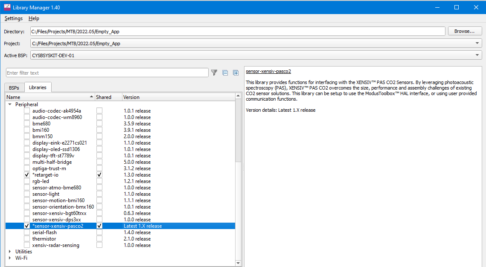
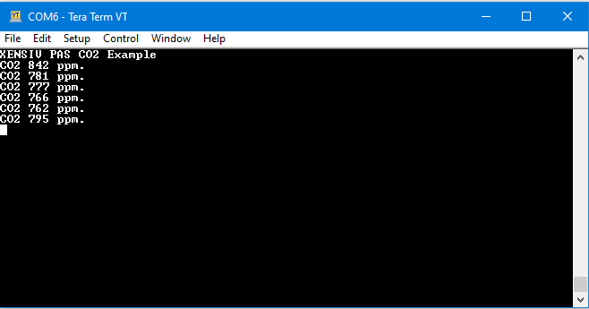

# XENSIV™ PAS CO2 sensor

## Overview

This library provides functions for interfacing with the XENSIV™ PAS CO2 sensor.

The sensor features a small form factor with accurate and robust performance at ppm level (±30 ppm ±3% of reading). The XENSIV™ PAS CO2 sensor integrates a photo-acoustic transducer and a microcontroller which runs ppm calculations as well as compensation and configuration algorithms on the PCB.

### Quick start

For the hardware setup, check the "Quick start with the PSoC™ 6 Wi-Fi Bluetooth&reg; pioneer kit" section of the [Programming guide for XENSIV™ PAS CO2 sensor](https://www.infineon.com/cms/de/product/sensor/co2-sensors/#!?fileId=5546d4627600a6bc0176041139e77780).

**Figure 1. XENSIV™ PAS CO2 Sensor2Go kit I2C interface connection to the PSoC™ 6 Wi-Fi Bluetooth&reg; pioneer kit**





Alternatively you can use the [CYSBSYSKIT-DEV-01 Rapid IoT Connect Developer Kit](https://github.com/Infineon/TARGET_CYSBSYSKIT-DEV-01) together with the XENSIV™ PAS CO2 Wing Board.


Do the following to create a simple application which outputs the CO2 ppm data from the sensor to the UART.

1. Create an empty ModusToolbox application for your board, e.g. CYSBSYSKIT-DEV-01.

2. Add this library, i.e. sensor-xensiv-pasco2, to the application using the Library Manager.

   **Figure 2. Library Manager**

   
   

3. Add the retarget-io library using the Library Manager.

4. Place the following code in the *main.c* file.

5. Define I2C SDA and SCL as appropriate for your hardware configuration. 
   **Note** If using CYSBSYSDEV-DEV-01 kit and PAS CO2 wingboard, define macro USE_CYSBSYSDEV_KIT_01_WINGBOARD

```cpp
#include "cyhal.h"
#include "cybsp.h"
#include "cy_retarget_io.h"
#include "xensiv_pasco2_mtb.h"

/*******************************************************************************
* Macros
*******************************************************************************/
#define PIN_XENSIV_PASCO2_I2C_SDA   	CYBSP_I2C_SDA
#define PIN_XENSIV_PASCO2_I2C_SCL   	CYBSP_I2C_SCL

#if defined(USE_CYSBSYSDEV_KIT_01_WINGBOARD)
/* Output pin for sensor PSEL line */
#define PIN_XENSIV_PASCO2_PSEL   		P5_3
/* Output pin for PAS CO2 Wing Board power switch */
#define PIN_XENSIV_PASCO2_POWER_SWITCH  P10_5
#endif

#define I2C_MASTER_FREQUENCY        	(100000U)

/* Wait time for sensor ready (milliseconds) */
#define WAIT_SENSOR_RDY_MS          	(2000)

/* The CO2 concentration value acquired by the sensor depends on the external atmospheric pressure.
   To compensate for this effect, pressure values can be acquired from a pressure sensor such as an
   Infineon XENSIV&trade; DPS3xx. (https://github.com/Infineon/sensor-xensiv-dps3xx) */
#define DEFAULT_PRESSURE_REF_HPA        (0x3F7)     /* Default atmospheric pressure to compensate for (hPa) */

/*******************************************************************************
* Global Variables
*******************************************************************************/
static cyhal_i2c_t cyhal_i2c;
static xensiv_pasco2_t xensiv_pasco2;

int main(void)
{
    cy_rslt_t result = CY_RSLT_SUCCESS;

    /* Initialize the device and board peripherals */
    result = cybsp_init();
    CY_ASSERT(result == CY_RSLT_SUCCESS);

    __enable_irq();

    /* Initialize retarget-io to use the debug UART port. */
    result = cy_retarget_io_init(CYBSP_DEBUG_UART_TX, CYBSP_DEBUG_UART_RX, CY_RETARGET_IO_BAUDRATE);
    CY_ASSERT(result == CY_RSLT_SUCCESS);

    printf("XENSIV PAS CO2 Example\r\n");

    /* Initialize I2C */
    cyhal_i2c_cfg_t i2c_master_config = {CYHAL_I2C_MODE_MASTER,
                                         0,
                                         I2C_MASTER_FREQUENCY};

    result = cyhal_i2c_init(&cyhal_i2c, PIN_XENSIV_PASCO2_I2C_SDA, PIN_XENSIV_PASCO2_I2C_SCL, NULL);
    CY_ASSERT(result == CY_RSLT_SUCCESS);

    result = cyhal_i2c_configure(&cyhal_i2c, &i2c_master_config);
    CY_ASSERT(result == CY_RSLT_SUCCESS);

#if defined(USE_CYSBSYSDEV_KIT_01_WINGBOARD)
    /* Initialize and enable PAS CO2 Wing Board I2C channel communication*/
    result = cyhal_gpio_init(PIN_XENSIV_PASCO2_PSEL, CYHAL_GPIO_DIR_OUTPUT, CYHAL_GPIO_DRIVE_STRONG, false);
    CY_ASSERT(result == CY_RSLT_SUCCESS);

    /* Initialize and enable PAS CO2 Wing Board power switch */
    result = cyhal_gpio_init(PIN_XENSIV_PASCO2_POWER_SWITCH, CYHAL_GPIO_DIR_OUTPUT, CYHAL_GPIO_DRIVE_STRONG, true);
    CY_ASSERT(result == CY_RSLT_SUCCESS);
#endif

    cyhal_system_delay_ms(WAIT_SENSOR_RDY_MS);

    /* Initialize PAS CO2 sensor with default parameter values */
    result = xensiv_pasco2_mtb_init_i2c(&xensiv_pasco2, &cyhal_i2c);
    if (result != CY_RSLT_SUCCESS)
    {
        printf("PAS CO2 device initialization error");
        CY_ASSERT(0);
    }

#if defined(USE_CYSBSYSDEV_KIT_01_WINGBOARD)
    /* Configure PAS CO2 Wing board interrupt to enable 12V boost converter in wingboard */
    xensiv_pasco2_interrupt_config_t int_config =
    {
        .b.int_func = XENSIV_PASCO2_INTERRUPT_FUNCTION_NONE,
        .b.int_typ = (uint32_t)XENSIV_PASCO2_INTERRUPT_TYPE_LOW_ACTIVE
    };

    result = xensiv_pasco2_set_interrupt_config(&xensiv_pasco2, int_config);
    if (result != CY_RSLT_SUCCESS)
    {
        printf("PAS CO2 interrupt configuration error");
        CY_ASSERT(0);
    }
#endif

    uint16_t ppm;
    for (;;)
    {
        result = xensiv_pasco2_mtb_read(&xensiv_pasco2, DEFAULT_PRESSURE_REF_HPA, &ppm);
        if (result == CY_RSLT_SUCCESS)
        {
            printf("CO2 %d ppm.\n", ppm);
        }
        cyhal_system_delay_ms(10);
    }
}
```
6. Connect the board to your PC using the provided USB cable through the KitProg3 USB connector.

7. Open a terminal program and select the KitProg3 COM port. Set the serial port parameters to 8N1 and 115200 baud.

8. Build the application and program the kit. After programming, the application starts automatically.

   **Figure 3. Terminal output on program startup**

   
   


### Use the library in your own platform

The library can be used in your own platform copying following files to your project:
- *xensiv_pasco2.c*
- *xensiv_pasco2.h*
- *xensiv_pasco2_platform.h*
- *xensiv_pasco2_regs.h*.

The library depends on platform-specific implementation of functions declared in *xensiv_pasco2_platform.h*:

```cpp
/* Target platform-specific function to perform I2C write/read transfer. Only needed if using I2C sensor interface */
int32_t xensiv_pasco2_plat_i2c_transfer(void * ctx, uint16_t dev_addr, const uint8_t * tx_buffer, size_t tx_len, uint8_t * rx_buffer, size_t rx_len);

/* Target platform-specific function to read over UART. Only needed if using UART sensor interface */
int32_t xensiv_pasco2_plat_uart_read(void *ctx, uint8_t * data, size_t len);

/* Target platform-specific function to write over UART. Only needed if using UART sensor interface */
int32_t xensiv_pasco2_plat_uart_write(void *ctx, const uint8_t * data, size_t len);

/* Target platform-specific function that waits for a specified time period in milliseconds */
void xensiv_pasco2_plat_delay(uint32_t ms);

/* Target platform-specific function to reverse the byte order (16-bit) */
uint16_t xensiv_pasco2_plat_htons(uint16_t x);

/* Target platform-specific function that implements a runtime assertion; used to verify the assumptions made by the program and take appropiate actions if assumption is false */
void xensiv_pasco2_plat_assert(int expr);
```

See an implementation for the platform-specific functions in *xensiv_pasco2_mtb.c* using the PSoC™ 6 HAL.

### More information

- [PAS CO2 sensor API reference guide](https://infineon.github.io/sensor-xensiv-pasco2/html/index.html)
- [XENSIV™ PAS CO2 sensor](https://www.infineon.com/cms/en/product/sensor/co2-sensors/)
- [Connected sensor kit](https://www.infineon.com/connectedsensorkit)
- [EVAL_PASCO2_MINIBOARD](https://www.infineon.com/cms/en/product/evaluation-boards/eval_pasco2_miniboard)
- [Infineon Technologies website](https://www.infineon.com)
- [Infineon Technologies GitHub repos](https://github.com/infineon)
- [ModusToolbox&trade; software](https://www.cypress.com/products/modustoolbox-software-environment)

---
© Infineon Technologies AG, 2021-2022.
